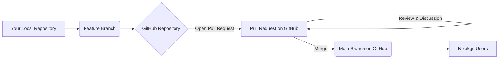

# Chapter 11

<details>
<summary> ✔️ Click to Expand Table of Contents</summary>

<!-- toc -->

</details>


## Nix Pull Requests

**Pull requests** communicate changes to a branch in a repository. Once a pull
request is opened, you can review changes with collaborators and add follow-up
commits.

- A **pull request** is a proposal to merge a set of changes from one branch
  into another. In a pull request, collaborators can review and discuss the
  proposed set of changes before they integrate the changes into the main
  codebase.

- Pull requests display the differences, or diffs, between the content in the
  source branch and the content in the target branch.



**Explanation of the Diagram**:

<details>
<summary> ✔️ Click to see Explanation </summary>

- **A[Your Local Repository]**: This represents the copy of the Nixpkgs repo on
  your computer where you make changes.

- **B (Feature Branch)**: You create a dedicated branch (e.g.`my-pack-update`)
  to isolate your changes.

- **C {GitHub Repository}**: This is the central online repo for Nixpkgs on
  Github. You push your feature branch to this repo.

- **C -- "Open Pull Request" -- D [Pull Request on Github]**: You initiate a
  pull request from your feature branch to the main branch (usually `master` or
  `main`) through the GitHub interface.

- **D [Pull Request on GitHub]**: This is where collaborators can see your
  proposed changes, discuss them, and provide feedback.

- **D -- "Review & Discussion" --> D**: The pull request facilitates
  communication and potential revisions based on the review.

- **D -- "Merge" --> E (Main Branch on GitHub)**: Once the changes are approved,
  they are merged into the main branch of the Nixpkgs repository.

- **E (Main Branch on GitHub)**: The main branch now contains the integrated
  changes.

- **E --> F [Nixpkgs Users]**): Eventually, these changes become available to
  all Nixpkgs users through updates to their Nix installations.

</details>

Flakes often rely on having access to the full history of the Git repository to
correctly determine dependencies, identify specific revisions of inputs, and
evaluate the flake. Not in all situations will a shallow clone work and this is
one of them.

If you have any changes to your local copy of Nixpkgs make sure to stash them
before the following:

```bash
git stash -u
```

- This command saves your uncommited changes (including staged files)
  temporarily. You can restore them later with `git stash pop`

**Step 1 Clone Nixpkgs Locally**

If you don't have Nixpkgs locally, you'll need to clone it:

```bash
git clone https://github.com/NixOS/nixpkgs.git
```

**Step 2 Find a Relevant Pull Request**

To find specifig commits and releases:

[status.nixos.org](https://status.nixos.org/) provides the latest tested commits
for each release - use when pinning to specific commits. List of active release
channels - use when tracking latest channel versions.

The complete list of channels is available at
[nixos.org/channels](https://channels.nixos.org/)

To find a relevant PR you can go to:

- [Nixpkgs Pull Requests](https://github.com/NixOS/nixpkgs/pulls)

- The following example actually uses the
  [Nix Pull Requests](https://github.com/NixOS/nix/pulls) the process is the
  same, but that is an important distinction.

- In the Filters enter `stack trace` for this example.

- The pull request I chose was [8623](https://github.com/nixos/nix/pull/8623)

**Step 3 Add the Remote Repository (if necessary)**

If the pull request is from a different repository than your local clone (as in
the case of the `nix` PR while working in a `nixpkgs` clone), you need to add
that repository as a remote. It's common to name the main Nixpkgs remote
`origin` and other related repositories like `nix` as `upstream`.

Assuming you are in your `nixpkgs` clone and want to test a PR from the `nix`
repository:

```bash
git remote add upstream https://github.com/NixOS/nix.git
```

**Step 4 Fetch the Pull Request Changes**

Fetch the Pull Request Information:

```bash
git fetch upstream refs/pull/8623/head:pr-8623
```

- This command fetches the branch named `head` from the pull request `8623` in
  the `upstream` remote and creates a local branch named `pr-8623` that tracks
  it.

**Output**:

<details>
<summary> ✔️ Output (Click to Enlarge) </summary>

```
remote: Enumerating objects: 104651, done.
remote: Counting objects: 100% (45/45), done.
remote: Compressing objects: 100% (27/27), done.
remote: Total 104651 (delta 33), reused 20 (delta 18), pack-reused 104606 (from 1)
Receiving objects: 100% (104651/104651), 61.64 MiB | 12.56 MiB/s, done.
Resolving deltas: 100% (74755/74755), done.
From https://github.com/NixOS/nix
 * [new ref]             refs/pull/8623/head -> pr-8623
 * [new tag]             1.0                 -> 1.0
 * [new tag]             1.1                 -> 1.1
 * [new tag]             1.10                -> 1.10
 * [new tag]             1.11                -> 1.11
 * [new tag]             1.11.1              -> 1.11.1
 * [new tag]             1.2                 -> 1.2
 * [new tag]             1.3                 -> 1.3
 * [new tag]             1.4                 -> 1.4
 * [new tag]             1.5                 -> 1.5
 * [new tag]             1.5.1               -> 1.5.1
 * [new tag]             1.5.2               -> 1.5.2
 * [new tag]             1.5.3               -> 1.5.3
 * [new tag]             1.6                 -> 1.6
 * [new tag]             1.6.1               -> 1.6.1
 * [new tag]             1.7                 -> 1.7
 * [new tag]             1.8                 -> 1.8
 * [new tag]             1.9                 -> 1.9
 * [new tag]             2.0                 -> 2.0
 * [new tag]             2.2                 -> 2.2
```

</details>

**Step 5 Checkout the Local Branch:**

```bash
git checkout pr-8623
```

Or with the `gh` cli:

```bash
gh pr checkout 8623
```

## Build and Test the Changes

- Now we want to see if the code changes introduced by the pull request actually
  build correctly within the Nix ecosystem.

```bash
nix build
```

**Output:**

<details>
<summary> ✔️ Output (Click to Enlarge) </summary>

```bash
error: builder for '/nix/store/rk86daqgf6a9v6pdx6vcc5b580lr9f09-nix-2.20.0pre20240115_20b4959.drv' failed with exit code 2;
   last 25 log lines:
   >
   >         _NIX_TEST_ACCEPT=1 make tests/functional/lang.sh.test
   >
   >     to regenerate the files containing the expected output,
   >     and then view the git diff to decide whether a change is
   >     good/intentional or bad/unintentional.
   >     If the diff contains arbitrary or impure information,
   >     please improve the normalization that the test applies to the output.
   > make: *** [mk/lib.mk:90: tests/functional/lang.sh.test] Error 1
   > make: *** Waiting for unfinished jobs....
   > ran test tests/functional/selfref-gc.sh... [PASS]
   > ran test tests/functional/store-info.sh... [PASS]
   > ran test tests/functional/suggestions.sh... [PASS]
   > ran test tests/functional/path-from-hash-part.sh... [PASS]
   > ran test tests/functional/gc-auto.sh... [PASS]
   > ran test tests/functional/path-info.sh... [PASS]
   > ran test tests/functional/flakes/show.sh... [PASS]
   > ran test tests/functional/fetchClosure.sh... [PASS]
   > ran test tests/functional/completions.sh... [PASS]
   > ran test tests/functional/build.sh... [PASS]
   > ran test tests/functional/impure-derivations.sh... [PASS]
   > ran test tests/functional/build-delete.sh... [PASS]
   > ran test tests/functional/build-remote-trustless-should-fail-0.sh... [PASS]
   > ran test tests/functional/build-remote-trustless-should-pass-2.sh... [PASS]
   > ran test tests/functional/nix-profile.sh... [PASS]
   For full logs, run:
     nix log /nix/store/rk86daqgf6a9v6pdx6vcc5b580lr9f09-nix-2.20.0pre20240115_20b4959.drv
```

</details>

- **`nix build`** (Part of the Nix Unified CLI):
  - Declarative: when used within a Nix flake (`flake.nix`), `nix build` is a
    bit more declarative. It understands the outputs defined in your flake.

  - Clearer Output Paths: `nix build` typically places build outputs in the
    `./result` directory by default (similar to `nix-build`'s `result` symlink)

  - Better Error Reporting: It gives more informative error messages.

  - Future Direction

**Benefits of using `nix build`:**

- **Flake Integration:** `nix build` naturally understands the flake's outputs.

- **Development Shells:** When you are in a `nix develop` shell, `nix build` is
  the more idiomatic way to build packages defined in your dev environment.

- **Consistency:** Using the unified CLI promotes a more consistent workflow.

## Next Steps

As you can see this build failed, as for why the build failed, the key part of
the error message is:

```bash
make: *** [mk/lib.mk:90: tests/functional/lang.sh.test] Error 1
```

- This suggests that one of the functional tests (`lang.sh.test`) failed. This
  happens when the expected output of the test doesn't match the actual output.

This can heppen when:

1. The test expectations are outdated due to changes in the codebase.

2. The test captures environment-specific or transient outputs that are not
   properly normalized.

3. The test includes impure or non-deterministic information, making it hard to
   verify.

To address this, \_NIX_TEST_ACCEPT=1 is used as an override mechanism that tells
the test framework: > "Accept whatever output is generated as the new expected
result."

The message advises running:

```bash
_NIX_TEST_ACCEPT=1 make tests/functional/lang.sh.test
```

- This will regenerate the expected output files, allowing you to inspect what
  changed with `git diff`:

```bash
git diff tests/functional/lang.sh.test
```

- **Verifies if Changes are Intentional:** If the difference is reasonable and
  expected (due to a legitimate update in the logic), you can commit these
  changes to update the test suit. If not, you have to refine the test
  normalization process further.

If the changes seem valid, commit them:

```bash
git add tests/functional/lang.sh.test
git commit -m "Update expected test output for lang.sh.test"
```

Running the following will provide the full logs:

```bash
nix log /nix/store/rk86daqgf6a9v6pdx6vcc5b580lr9f09-nix-2.20.0pre20240115_20b4959.drv
```

### Conclusion

Testing Nixpkgs pull requests is a vital part of contributing to a healthy and
reliable Nix ecosystem. By following these steps, you can help ensure that
changes are well-vetted before being merged, ultimately benefiting all Nix
users. Your efforts in testing contribute significantly to the quality and
stability of Nixpkgs.
